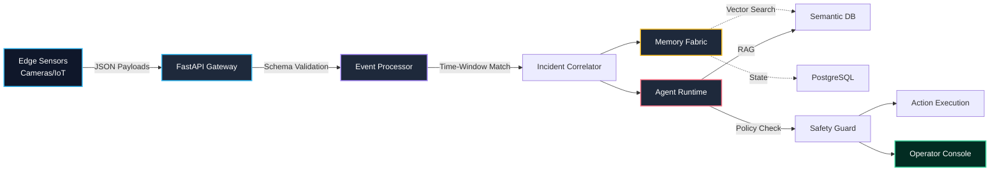

<div align="center">

# 🌌 AMIF v1.0
**Autonomous Multi-Modal Incident Intelligence Fabric**

[](https://www.python.org/)
[](https://fastapi.tiangolo.com/)
[](https://www.docker.com/)
[](https://opensource.org/licenses/MIT)

*A production-grade, event-driven AI architecture project for real-time, multi-modal incident intelligence and agentic investigations.*

[Operator Console](http://localhost:8000/static/console.html) · [Architecture Details](http://localhost:8000/static/architecture.html) · [API Docs](http://localhost:8000/docs) · [Interactive Report](http://localhost:8000/reports/AMIF_Interactive_Project_Report.html)

</div>

---

## ⚡ Executive Summary

**AMIF** (Autonomous Multi-Modal Incident Intelligence Fabric) is an advanced, enterprise-ready AI platform designed to ingest and correlate high-velocity signals from diverse edge sources—including RTSP Cameras, IoT Sensors, Microphones, and standard operating procedure (SOP) Documents. 

Instead of relying on human operators to stare at monitors and match anomalies, AMIF automatically validates, deduplicates, and enriches these events in real time. Once an anomaly is detected, an **Agentic Workflow** kicks in: retrieving semantic evidence from vector memory, reasoning through risk factors, generating safety guardrails, and presenting a holistic view via a high-end, premium Operator Dashboard.

---

## 🎯 Core Use Cases

AMIF is designed to be highly adaptable to various physical-world monitoring scenarios:

1. **🏭 Smart Manufacturing & Industrial IoT**
   - **Scenario**: A critical CNC machine exhibits an IoT temperature spike while an audio sensor detects a grinding anomaly.
   - **AMIF Response**: Correlates the two events, queries the machine's maintenance manual using RAG, determines a high risk of catastrophic failure, and issues a severe alert recommending immediate shutdown.
2. **🏢 Warehouse Safety & Logistics**
   - **Scenario**: A camera detects a forklift moving at high speed in a pedestrian-only zone.
   - **AMIF Response**: Logs the safety violation, links it to the site safety protocol document, and automatically drafts an incident report for the shift supervisor.
3. **🏙️ Smart City Operations**
   - **Scenario**: Traffic cameras detect a collision, and nearby microphones register a loud impact.
   - **AMIF Response**: Fuses the multi-modal data, assesses the severity, and prepares a structured payload for emergency dispatch APIs.
4. **🔐 Secure Facility Monitoring**
   - **Scenario**: A badge-swipe is registered at a secure door, but the camera detects two faces (tailgating).
   - **AMIF Response**: Flags the anomaly, cross-references the access control policy, and alerts the guard station with the exact video frame evidence.

---

## 🧠 Agentic Workflow Engine

AMIF moves beyond simple rules-based alerts by utilizing a **Deterministic Agentic Runtime** composed of specialized AI personas:

- **👁️ Observer**: Continuously monitors the event stream and identifies raw anomalies (e.g., "Temperature > 85°C").
- **🕵️ Investigator**: Groups related anomalies within specific time-windows and locations into structured **Incidents**.
- **📚 Retriever**: Queries the Qdrant/Postgres vector database to find relevant SOPs, safety manuals, or past resolutions.
- **🗺️ Planner**: Analyzes the evidence and formulates a step-by-step resolution plan.
- **🛡️ Safety Guard**: A deterministic policy engine that reviews the Planner's suggestions to ensure no autonomous actions violate enterprise safety rules.
- **⚙️ Action Executor**: Dispatches approved actions (e.g., sending emails, creating Jira tickets, triggering webhooks).

---

## 🔄 Platform Architecture & Data Flow



### The Memory Fabric
- **Durable Layer**: PostgreSQL handles immutable event logs, incident states, and audit trails.
- **Episodic Layer**: Redis-ready architecture for fast, transient state and rate-limiting.
- **Semantic Layer**: Qdrant-ready vector store (with a deterministic Postgres fallback) for chunking and retrieving document context via RAG.
- **Graph Layer**: Neo4j-style endpoints that map relationships between locations, sensors, incidents, and people.

---

## 🛠️ Technology Stack Matrix

| Domain | Technologies Used | Purpose |
| :--- | :--- | :--- |
| **Backend API** | FastAPI, Pydantic, Python 3.10+ | High-performance, async REST gateway and data validation. |
| **Security** | Bcrypt, PyJWT, SlowAPI, OAuth2 | Secure password hashing, stateless tokens, and brute-force rate limiting. |
| **Database** | SQLAlchemy, PostgreSQL, SQLite | Robust ORM and relational state management. |
| **Frontend** | Vanilla JS, HTML5, CSS3 (HSL) | Premium glassmorphism UI, zero-dependency Markdown rendering. |
| **Observability** | Prometheus, Grafana | API metric instrumentation and performance dashboards. |
| **Infrastructure** | Docker, Docker Compose, K8s | Containerization and cloud-native orchestration readiness. |

---

## 📂 Unified Project Structure

All application code, connectors, and infrastructure bindings have been cleanly unified into a monolithic backend structure for deployment ease.

```text
amif/
├── backend/app/                 # Core Application Namespace
│   ├── connectors/              # Integrations: camera_connector, audio_connector, iot_connector
│   ├── core/                    # Config, Security (Bcrypt/JWT), RBAC, Rate Limiting
│   ├── db/                      # SQLAlchemy Engine, Sessions & Migrations
│   ├── infra/                   # Kubernetes Manifests & Prometheus Configs
│   ├── models/                  # ORM Database Models & Enums
│   ├── routers/                 # FastAPI REST Endpoints (Auth, Events, Incidents)
│   ├── schemas/                 # Pydantic Validation Contracts
│   ├── scripts/                 # Demo Seed Scripts & Utilities
│   ├── services/                # Business Logic (Event Processor, Agents, RAG)
│   ├── static/                  # Premium Operator Console UI & Assets
│   └── workers/                 # Background Task Processors
├── docs/                        # Architecture & UX Blueprints (.md)
├── reports/                     # Generated HTML, PDF, and PPTX reports
├── index.html                   # Centralized Workspace Portal Hub
└── docker-compose.yml           # Local multi-container orchestration
```

---

## 🚀 Quick Start Guide

### Option A: Using Docker (Recommended)

1. Clone the repository and navigate to the project root.
2. Initialize environment variables:
   ```bash
   cp .env.example .env
   ```
3. Spin up the infrastructure:
   ```bash
   docker compose up --build
   ```

### Option B: Local Python Execution

1. Navigate to the backend directory and set up a virtual environment:
   ```bash
   cd backend
   python -m venv .venv
   # Windows: .venv\Scripts\activate
   # Mac/Linux: source .venv/bin/activate
   ```
2. Install dependencies:
   ```bash
   pip install -r requirements.txt
   ```
3. Launch the FastAPI server:
   ```bash
   uvicorn app.main:app --reload --host 127.0.0.1 --port 8000
   ```

---

## 🎮 The Demo Experience

Once the server is running, the entire ecosystem is mapped and accessible from the root domain!

1. **Launch the Portal**: Open your browser to `http://127.0.0.1:8000/`. You will be greeted by the Central Workspace Hub.
2. **Access the Console**: Click "Launch Console" and log in using the default secure credentials:
   - **Email**: `admin@example.com`
   - **Password**: `admin123`
3. **Run the Scenario**: Click the **Seed Demo** button in the console.
   - **The Simulation**: AMIF automatically uploads a Machine Safety Manual via the Document Connector, fires a Forklift proximity event via the Camera Connector, and triggers an overheating reading via the IoT Connector.
   - **The Intelligence**: The Event Processor correlates these into a critical incident. The Agent Workflow wakes up, consults the uploaded manual using RAG, enforces safety guardrails, and publishes an Operator Alert.
4. **Observe**: Navigate through the console to view the raw events, explore the semantic evidence, review the generated tickets, and inspect the unified incident timeline.

---

## 📖 Developer Documentation & Observability

- **Centralized Workspace Hub**: `http://localhost:8000/` (Reads directly from the `/docs` directory)
- **Interactive OpenAPI Specs**: `http://localhost:8000/docs`
- **Prometheus Metrics**: `http://localhost:9090`
- **Grafana Dashboards**: `http://localhost:3000` *(admin/admin)*

---

## 🔮 Roadmap & Future Extensions

- **Microservice Extraction**: Split the monolithic `backend/app` into dedicated Pods (e.g., Ingestion Service, Agent Service).
- **Real LLM Integration**: Hook the Agent Runtime into OpenAI/Anthropic APIs instead of the deterministic MVP fallback.
- **Event Streaming**: Replace the synchronous in-memory processor with Redpanda/Kafka topics using FastStream.
- **Native Vector DB**: Swap the Postgres fallback for a fully dedicated Qdrant instance.

---

<div align="center">
<i>Architected with ❤️ for modern AI Safety & Operations</i><br>
<b>Distributed under the MIT License.</b>
</div>
